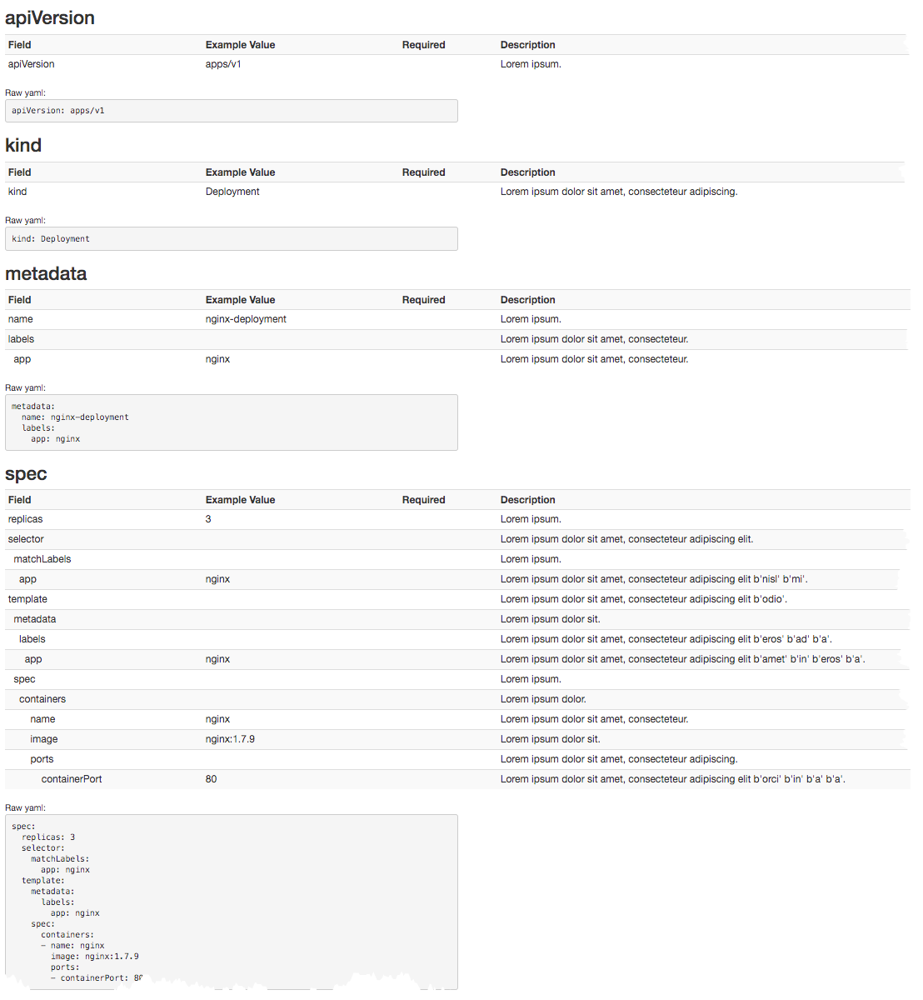
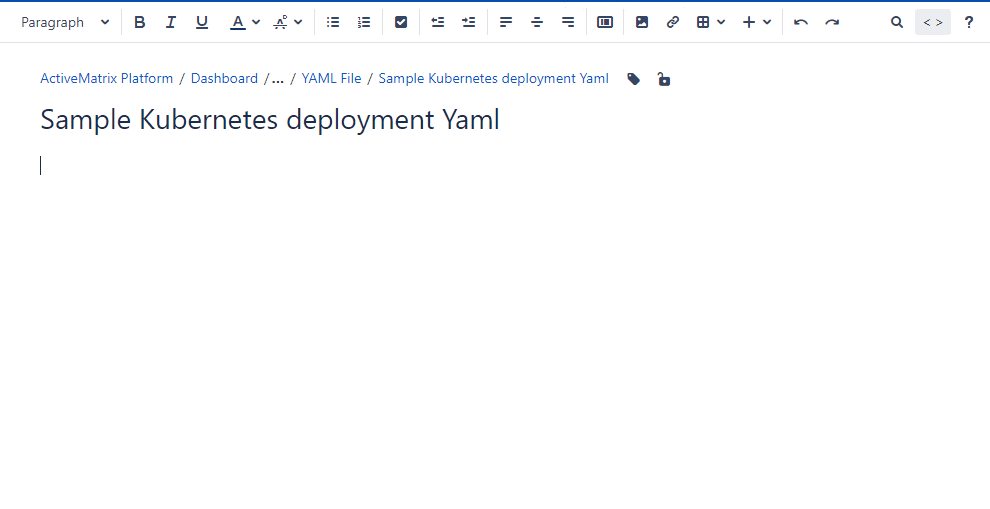

# yaml-to-table
Convert YAML file to text/html table for documentation 

# Introduction 
  Time to time I needed to document YAML files for end-users. And best way so far we have seen is to build
  table and put each field in table row and document it. 
  I need a quick script that will take YAML file and generated (html) table;
   only thing I needed to do was to input some help text that explains field
   
   Above need gave way to this python script; it will do just that - given input (yaml) file it will   
   it iterates over each yaml section and builds table(s) out of it 
   
   As of now it creates multiple tables based on top level YAML sections  
   
   This mainly uses two python libraries '*pyaml*' and '*prettyTable*' 
   
   [PYAML](https://pyyaml.org/wiki/PyYAML): For reading the yaml file    
   [PrettyTable](https://pypi.org/project/PrettyTable/): For printing text tables or HTML table    
   
   ** Note ** : In this script I actually used 
   [oyaml](https://github.com/wimglenn/oyaml) as it preserves order in python dictionary
   
   For field description, it will just generate random Lorem ipsum one-liner text using python library *loremipsum*   

# Usage

```bash
py -3 -m venv venv
source venv/Scripts/activate
pip install -r requirements.txt
```

```bash
> python yaml_to_table.py -h
usage: yaml_to_table.py [-h] --inputFile INPUTFILE [--out {txt,html,text}]

YAML file to (HTML) table converter

optional arguments:
  -h, --help            show this help message and exit
  --inputFile INPUTFILE
                        input yaml file to process
  --out {txt,html,text}
                        convert yaml to text table or html table

text table will be printed as STDOUT - html table will be save in html file
```

# Sample 

Let's take an example of simple kubernetes deployment file (as show below)

```yaml
apiVersion: apps/v1
kind: Deployment
metadata:
  name: nginx-deployment
  labels:
    app: nginx
spec:
  replicas: 3
  selector:
    matchLabels:
      app: nginx
  template:
    metadata:
      labels:
        app: nginx
    spec:
      containers:
      - name: nginx
        image: nginx:1.7.9
        ports:
        - containerPort: 80
```

If you run script with this command:

```bash
python yaml_to_table.py --inputFile samples/flavors.yaml --out text
```

You will see output like this:

```bash
=> nova_flavors:
+------------------------------+---------------+
| Field                        | Value         |
+------------------------------+---------------+
|                              |               |
| disk                         | 10            |
| name                         | m1.tiny       |
| properties                   |               |
|   quota:disk_read_bytes_sec  | 12500000      |
|   quota:disk_read_iops_sec   | 1000          |
|   quota:disk_write_bytes_sec | 3125000       |
|   quota:disk_write_iops_sec  | 250           |
|   quota:vif_inbound_average  | 2500          |
|   quota:vif_inbound_burst    | 3750000       |
|   quota:vif_inbound_peak     | 12500         |
|   quota:vif_outbound_average | 2500          |
|   quota:vif_outbound_burst   | 3750000       |
|   quota:vif_outbound_peak    | 12500         |
| ram                          | 1024          |
| vcpus                        | 1             |
|                              |               |
| disk                         | 10            |
| name                         | m1.small      |
| properties                   |               |
|   quota:disk_read_bytes_sec  | 25000000      |
|   quota:disk_read_iops_sec   | 2000          |
|   quota:disk_write_bytes_sec | 6250000       |
|   quota:disk_write_iops_sec  | 500           |
|   quota:vif_inbound_average  | 5000          |
|   quota:vif_inbound_burst    | 7500000       |
|   quota:vif_inbound_peak     | 25000         |
|   quota:vif_outbound_average | 5000          |
|   quota:vif_outbound_burst   | 7500000       |
|   quota:vif_outbound_peak    | 25000         |
| ram                          | 2048          |
| vcpus                        | 1             |
|                              |               |
| disk                         | 10            |
| name                         | m1.medium     |
| properties                   |               |
|   quota:disk_read_bytes_sec  | 50000000      |
|   quota:disk_read_iops_sec   | 4000          |
|   quota:disk_write_bytes_sec | 12500000      |
|   quota:disk_write_iops_sec  | 1000          |
|   quota:vif_inbound_average  | 10000         |
|   quota:vif_inbound_burst    | 15000000      |
|   quota:vif_inbound_peak     | 50000         |
|   quota:vif_outbound_average | 10000         |
|   quota:vif_outbound_burst   | 15000000      |
|   quota:vif_outbound_peak    | 50000         |
| ram                          | 4096          |
| vcpus                        | 2             |
|                              |               |
| disk                         | 10            |
| name                         | m1.large      |
| properties                   |               |
|   quota:disk_read_bytes_sec  | 64000000      |
|   quota:disk_read_iops_sec   | 6000          |
|   quota:disk_write_bytes_sec | 16000000      |
|   quota:disk_write_iops_sec  | 1500          |
|   quota:vif_inbound_average  | 20000         |
|   quota:vif_inbound_burst    | 30000000      |
|   quota:vif_inbound_peak     | 100000        |
|   quota:vif_outbound_average | 20000         |
|   quota:vif_outbound_burst   | 30000000      |
|   quota:vif_outbound_peak    | 100000        |
| ram                          | 8192          |
| vcpus                        | 4             |
|                              |               |
| disk                         | 10            |
| name                         | m1.xlarge     |
| properties                   |               |
|   quota:disk_read_bytes_sec  | 128000000     |
|   quota:disk_read_iops_sec   | 8000          |
|   quota:disk_write_bytes_sec | 32000000      |
|   quota:disk_write_iops_sec  | 2000          |
|   quota:vif_inbound_average  | 40000         |
|   quota:vif_inbound_burst    | 60000000      |
|   quota:vif_inbound_peak     | 200000        |
|   quota:vif_outbound_average | 40000         |
|   quota:vif_outbound_burst   | 60000000      |
|   quota:vif_outbound_peak    | 200000        |
| ram                          | 16384         |
| vcpus                        | 8             |
|                              |               |
| disk                         | 10            |
| name                         | c1.xlarge     |
| properties                   |               |
|   quota:disk_read_bytes_sec  | 131072000     |
|   quota:disk_read_iops_sec   | 12000         |
|   quota:disk_write_bytes_sec | 32768000      |
|   quota:disk_write_iops_sec  | 3000          |
|   quota:vif_inbound_average  | 128000        |
|   quota:vif_inbound_burst    | 46080000      |
|   quota:vif_inbound_peak     | 255000        |
|   quota:vif_outbound_average | 128000        |
|   quota:vif_outbound_burst   | 46080000      |
|   quota:vif_outbound_peak    | 255000        |
| ram                          | 46080         |
| vcpus                        | 10            |
|                              |               |
| disk                         | 10            |
| name                         | c1.2xlarge    |
| properties                   |               |
|   quota:disk_read_bytes_sec  | 262144000     |
|   quota:disk_read_iops_sec   | 16000         |
|   quota:disk_write_bytes_sec | 65536000      |
|   quota:disk_write_iops_sec  | 4000          |
|   quota:vif_inbound_average  | 256000        |
|   quota:vif_inbound_burst    | 92160000      |
|   quota:vif_inbound_peak     | 510000        |
|   quota:vif_outbound_average | 256000        |
|   quota:vif_outbound_burst   | 92160000      |
|   quota:vif_outbound_peak    | 512000        |
| ram                          | 92160         |
| vcpus                        | 20            |
|                              |               |
| disk                         | 10            |
| name                         | c1.4xlarge    |
| properties                   |               |
|   quota:disk_read_bytes_sec  | 524288000     |
|   quota:disk_read_iops_sec   | 32000         |
|   quota:disk_write_bytes_sec | 131072000     |
|   quota:disk_write_iops_sec  | 8000          |
|   quota:vif_inbound_average  | 512000        |
|   quota:vif_inbound_burst    | 184320000     |
|   quota:vif_inbound_peak     | 1020000       |
|   quota:vif_outbound_average | 512000        |
|   quota:vif_outbound_burst   | 184320000     |
|   quota:vif_outbound_peak    | 1020000       |
| ram                          | 184320        |
| vcpus                        | 40            |
|                              |               |
| disk                         | 10            |
| name                         | gpu.A100      |
| properties                   |               |
|   quota:disk_read_bytes_sec  | 262144000     |
|   quota:disk_read_iops_sec   | 16000         |
|   quota:disk_write_bytes_sec | 65536000      |
|   quota:disk_write_iops_sec  | 4000          |
|   quota:vif_inbound_average  | 256000        |
|   quota:vif_inbound_burst    | 92160000      |
|   quota:vif_inbound_peak     | 510000        |
|   quota:vif_outbound_average | 256000        |
|   quota:vif_outbound_burst   | 92160000      |
|   quota:vif_outbound_peak    | 512000        |
|   pci_passthrough:alias      | A100:1        |
| ram                          | 96256         |
| vcpus                        | 12            |
|                              |               |
| disk                         | 10            |
| name                         | custom.4c.16g |
| properties                   |               |
|   quota:disk_read_bytes_sec  | 131072000     |
|   quota:disk_read_iops_sec   | 12000         |
|   quota:disk_write_bytes_sec | 32768000      |
|   quota:disk_write_iops_sec  | 3000          |
|   quota:vif_inbound_average  | 128000        |
|   quota:vif_inbound_burst    | 46080000      |
|   quota:vif_inbound_peak     | 255000        |
|   quota:vif_outbound_average | 128000        |
|   quota:vif_outbound_burst   | 46080000      |
|   quota:vif_outbound_peak    | 255000        |
| ram                          | 16384         |
| vcpus                        | 4             |
|                              |               |
| disk                         | 10            |
| name                         | custom.4c.32g |
| properties                   |               |
|   quota:disk_read_bytes_sec  | 131072000     |
|   quota:disk_read_iops_sec   | 12000         |
|   quota:disk_write_bytes_sec | 32768000      |
|   quota:disk_write_iops_sec  | 3000          |
|   quota:vif_inbound_average  | 128000        |
|   quota:vif_inbound_burst    | 46080000      |
|   quota:vif_inbound_peak     | 255000        |
|   quota:vif_outbound_average | 128000        |
|   quota:vif_outbound_burst   | 46080000      |
|   quota:vif_outbound_peak    | 255000        |
| ram                          | 32768         |
| vcpus                        | 4             |
|                              |               |
| disk                         | 10            |
| name                         | custom.8c.32g |
| properties                   |               |
|   quota:disk_read_bytes_sec  | 131072000     |
|   quota:disk_read_iops_sec   | 12000         |
|   quota:disk_write_bytes_sec | 32768000      |
|   quota:disk_write_iops_sec  | 3000          |
|   quota:vif_inbound_average  | 128000        |
|   quota:vif_inbound_burst    | 46080000      |
|   quota:vif_inbound_peak     | 255000        |
|   quota:vif_outbound_average | 128000        |
|   quota:vif_outbound_burst   | 46080000      |
|   quota:vif_outbound_peak    | 255000        |
| ram                          | 32768         |
| vcpus                        | 8             |
|                              |               |
| disk                         | 10            |
| name                         | custom.8c.64g |
| properties                   |               |
|   quota:disk_read_bytes_sec  | 131072000     |
|   quota:disk_read_iops_sec   | 12000         |
|   quota:disk_write_bytes_sec | 32768000      |
|   quota:disk_write_iops_sec  | 3000          |
|   quota:vif_inbound_average  | 128000        |
|   quota:vif_inbound_burst    | 46080000      |
|   quota:vif_inbound_peak     | 255000        |
|   quota:vif_outbound_average | 128000        |
|   quota:vif_outbound_burst   | 46080000      |
|   quota:vif_outbound_peak    | 255000        |
| ram                          | 65536         |
| vcpus                        | 8             |
|                              |               |
| disk                         | 25            |
| name                         | m1.s2.tiny    |
| properties                   |               |
|   quota:disk_read_bytes_sec  | 12500000      |
|   quota:disk_read_iops_sec   | 1000          |
|   quota:disk_write_bytes_sec | 3125000       |
|   quota:disk_write_iops_sec  | 250           |
|   quota:vif_inbound_average  | 2500          |
|   quota:vif_inbound_burst    | 3750000       |
|   quota:vif_inbound_peak     | 12500         |
|   quota:vif_outbound_average | 2500          |
|   quota:vif_outbound_burst   | 3750000       |
|   quota:vif_outbound_peak    | 12500         |
| ram                          | 1024          |
| vcpus                        | 1             |
|                              |               |
| disk                         | 25            |
| name                         | m1.s2.small   |
| properties                   |               |
|   quota:disk_read_bytes_sec  | 25000000      |
|   quota:disk_read_iops_sec   | 2000          |
|   quota:disk_write_bytes_sec | 6250000       |
|   quota:disk_write_iops_sec  | 500           |
|   quota:vif_inbound_average  | 5000          |
|   quota:vif_inbound_burst    | 7500000       |
|   quota:vif_inbound_peak     | 25000         |
|   quota:vif_outbound_average | 5000          |
|   quota:vif_outbound_burst   | 7500000       |
|   quota:vif_outbound_peak    | 25000         |
| ram                          | 2048          |
| vcpus                        | 1             |
|                              |               |
| disk                         | 25            |
| name                         | m1.s2.medium  |
| properties                   |               |
|   quota:disk_read_bytes_sec  | 50000000      |
|   quota:disk_read_iops_sec   | 4000          |
|   quota:disk_write_bytes_sec | 12500000      |
|   quota:disk_write_iops_sec  | 1000          |
|   quota:vif_inbound_average  | 10000         |
|   quota:vif_inbound_burst    | 15000000      |
|   quota:vif_inbound_peak     | 50000         |
|   quota:vif_outbound_average | 10000         |
|   quota:vif_outbound_burst   | 15000000      |
|   quota:vif_outbound_peak    | 50000         |
| ram                          | 4096          |
| vcpus                        | 2             |
|                              |               |
| disk                         | 25            |
| name                         | m1.s2.large   |
| properties                   |               |
|   quota:disk_read_bytes_sec  | 64000000      |
|   quota:disk_read_iops_sec   | 6000          |
|   quota:disk_write_bytes_sec | 16000000      |
|   quota:disk_write_iops_sec  | 1500          |
|   quota:vif_inbound_average  | 20000         |
|   quota:vif_inbound_burst    | 30000000      |
|   quota:vif_inbound_peak     | 100000        |
|   quota:vif_outbound_average | 20000         |
|   quota:vif_outbound_burst   | 30000000      |
|   quota:vif_outbound_peak    | 100000        |
| ram                          | 8192          |
| vcpus                        | 4             |
|                              |               |
| disk                         | 25            |
| name                         | m1.s2.xlarge  |
| properties                   |               |
|   quota:disk_read_bytes_sec  | 128000000     |
|   quota:disk_read_iops_sec   | 8000          |
|   quota:disk_write_bytes_sec | 32000000      |
|   quota:disk_write_iops_sec  | 2000          |
|   quota:vif_inbound_average  | 40000         |
|   quota:vif_inbound_burst    | 60000000      |
|   quota:vif_inbound_peak     | 200000        |
|   quota:vif_outbound_average | 40000         |
|   quota:vif_outbound_burst   | 60000000      |
|   quota:vif_outbound_peak    | 200000        |
| ram                          | 16384         |
| vcpus                        | 8             |
|                              |               |
| disk                         | 25            |
| name                         | c1.s2.xlarge  |
| properties                   |               |
|   quota:disk_read_bytes_sec  | 131072000     |
|   quota:disk_read_iops_sec   | 12000         |
|   quota:disk_write_bytes_sec | 32768000      |
|   quota:disk_write_iops_sec  | 3000          |
|   quota:vif_inbound_average  | 128000        |
|   quota:vif_inbound_burst    | 46080000      |
|   quota:vif_inbound_peak     | 255000        |
|   quota:vif_outbound_average | 128000        |
|   quota:vif_outbound_burst   | 46080000      |
|   quota:vif_outbound_peak    | 255000        |
| ram                          | 46080         |
| vcpus                        | 10            |
|                              |               |
| disk                         | 25            |
| name                         | c1.s2.2xlarge |
| properties                   |               |
|   quota:disk_read_bytes_sec  | 262144000     |
|   quota:disk_read_iops_sec   | 16000         |
|   quota:disk_write_bytes_sec | 65536000      |
|   quota:disk_write_iops_sec  | 4000          |
|   quota:vif_inbound_average  | 256000        |
|   quota:vif_inbound_burst    | 92160000      |
|   quota:vif_inbound_peak     | 510000        |
|   quota:vif_outbound_average | 256000        |
|   quota:vif_outbound_burst   | 92160000      |
|   quota:vif_outbound_peak    | 512000        |
| ram                          | 92160         |
| vcpus                        | 20            |
|                              |               |
| disk                         | 25            |
| name                         | c1.s2.4xlarge |
| properties                   |               |
|   quota:disk_read_bytes_sec  | 524288000     |
|   quota:disk_read_iops_sec   | 32000         |
|   quota:disk_write_bytes_sec | 131072000     |
|   quota:disk_write_iops_sec  | 8000          |
|   quota:vif_inbound_average  | 512000        |
|   quota:vif_inbound_burst    | 184320000     |
|   quota:vif_inbound_peak     | 1020000       |
|   quota:vif_outbound_average | 512000        |
|   quota:vif_outbound_burst   | 184320000     |
|   quota:vif_outbound_peak    | 1020000       |
| ram                          | 184320        |
| vcpus                        | 40            |
|                              |               |
| disk                         | 25            |
| name                         | c2.s2.xlarge  |
| properties                   |               |
|   quota:disk_read_bytes_sec  | 131072000     |
|   quota:disk_read_iops_sec   | 12000         |
|   quota:disk_write_bytes_sec | 32768000      |
|   quota:disk_write_iops_sec  | 3000          |
|   quota:vif_inbound_average  | 128000        |
|   quota:vif_inbound_burst    | 46080000      |
|   quota:vif_inbound_peak     | 255000        |
|   quota:vif_outbound_average | 128000        |
|   quota:vif_outbound_burst   | 46080000      |
|   quota:vif_outbound_peak    | 255000        |
| ram                          | 32768         |
| vcpus                        | 16            |
|                              |               |
| disk                         | 25            |
| name                         | c2.s2.2xlarge |
| properties                   |               |
|   quota:disk_read_bytes_sec  | 262144000     |
|   quota:disk_read_iops_sec   | 16000         |
|   quota:disk_write_bytes_sec | 65536000      |
|   quota:disk_write_iops_sec  | 4000          |
|   quota:vif_inbound_average  | 256000        |
|   quota:vif_inbound_burst    | 92160000      |
|   quota:vif_inbound_peak     | 510000        |
|   quota:vif_outbound_average | 256000        |
|   quota:vif_outbound_burst   | 92160000      |
|   quota:vif_outbound_peak    | 512000        |
| ram                          | 65536         |
| vcpus                        | 32            |
|                              |               |
| disk                         | 25            |
| name                         | c2.s2.4xlarge |
| properties                   |               |
|   quota:disk_read_bytes_sec  | 524288000     |
|   quota:disk_read_iops_sec   | 32000         |
|   quota:disk_write_bytes_sec | 131072000     |
|   quota:disk_write_iops_sec  | 8000          |
|   quota:vif_inbound_average  | 512000        |
|   quota:vif_inbound_burst    | 184320000     |
|   quota:vif_inbound_peak     | 1020000       |
|   quota:vif_outbound_average | 512000        |
|   quota:vif_outbound_burst   | 184320000     |
|   quota:vif_outbound_peak    | 1020000       |
| ram                          | 81920         |
| vcpus                        | 40            |
+------------------------------+---------------+
Raw yaml:
        nova_flavors:
        - disk: 10
          name: m1.tiny
          properties:
            quota:disk_read_bytes_sec: 12500000
            quota:disk_read_iops_sec: 1000
            quota:disk_write_bytes_sec: 3125000
            quota:disk_write_iops_sec: 250
            quota:vif_inbound_average: 2500
            quota:vif_inbound_burst: 3750000
            quota:vif_inbound_peak: 12500
            quota:vif_outbound_average: 2500
            quota:vif_outbound_burst: 3750000
            quota:vif_outbound_peak: 12500
          ram: 1024
          vcpus: 1
        - disk: 10
          name: m1.small
          properties:
            quota:disk_read_bytes_sec: 25000000
            quota:disk_read_iops_sec: 2000
            quota:disk_write_bytes_sec: 6250000
            quota:disk_write_iops_sec: 500
            quota:vif_inbound_average: 5000
            quota:vif_inbound_burst: 7500000
            quota:vif_inbound_peak: 25000
            quota:vif_outbound_average: 5000
            quota:vif_outbound_burst: 7500000
            quota:vif_outbound_peak: 25000
          ram: 2048
          vcpus: 1
        - disk: 10
          name: m1.medium
          properties:
            quota:disk_read_bytes_sec: 50000000
            quota:disk_read_iops_sec: 4000
            quota:disk_write_bytes_sec: 12500000
            quota:disk_write_iops_sec: 1000
            quota:vif_inbound_average: 10000
            quota:vif_inbound_burst: 15000000
            quota:vif_inbound_peak: 50000
            quota:vif_outbound_average: 10000
            quota:vif_outbound_burst: 15000000
            quota:vif_outbound_peak: 50000
          ram: 4096
          vcpus: 2
        - disk: 10
          name: m1.large
          properties:
            quota:disk_read_bytes_sec: 64000000
            quota:disk_read_iops_sec: 6000
            quota:disk_write_bytes_sec: 16000000
            quota:disk_write_iops_sec: 1500
            quota:vif_inbound_average: 20000
            quota:vif_inbound_burst: 30000000
            quota:vif_inbound_peak: 100000
            quota:vif_outbound_average: 20000
            quota:vif_outbound_burst: 30000000
            quota:vif_outbound_peak: 100000
          ram: 8192
          vcpus: 4
        - disk: 10
          name: m1.xlarge
          properties:
            quota:disk_read_bytes_sec: 128000000
            quota:disk_read_iops_sec: 8000
            quota:disk_write_bytes_sec: 32000000
            quota:disk_write_iops_sec: 2000
            quota:vif_inbound_average: 40000
            quota:vif_inbound_burst: 60000000
            quota:vif_inbound_peak: 200000
            quota:vif_outbound_average: 40000
            quota:vif_outbound_burst: 60000000
            quota:vif_outbound_peak: 200000
          ram: 16384
          vcpus: 8
        - disk: 10
          name: c1.xlarge
          properties:
            quota:disk_read_bytes_sec: 131072000
            quota:disk_read_iops_sec: 12000
            quota:disk_write_bytes_sec: 32768000
            quota:disk_write_iops_sec: 3000
            quota:vif_inbound_average: 128000
            quota:vif_inbound_burst: 46080000
            quota:vif_inbound_peak: 255000
            quota:vif_outbound_average: 128000
            quota:vif_outbound_burst: 46080000
            quota:vif_outbound_peak: 255000
          ram: 46080
          vcpus: 10
        - disk: 10
          name: c1.2xlarge
          properties:
            quota:disk_read_bytes_sec: 262144000
            quota:disk_read_iops_sec: 16000
            quota:disk_write_bytes_sec: 65536000
            quota:disk_write_iops_sec: 4000
            quota:vif_inbound_average: 256000
            quota:vif_inbound_burst: 92160000
            quota:vif_inbound_peak: 510000
            quota:vif_outbound_average: 256000
            quota:vif_outbound_burst: 92160000
            quota:vif_outbound_peak: 512000
          ram: 92160
          vcpus: 20
        - disk: 10
          name: c1.4xlarge
          properties:
            quota:disk_read_bytes_sec: 524288000
            quota:disk_read_iops_sec: 32000
            quota:disk_write_bytes_sec: 131072000
            quota:disk_write_iops_sec: 8000
            quota:vif_inbound_average: 512000
            quota:vif_inbound_burst: 184320000
            quota:vif_inbound_peak: 1020000
            quota:vif_outbound_average: 512000
            quota:vif_outbound_burst: 184320000
            quota:vif_outbound_peak: 1020000
          ram: 184320
          vcpus: 40
        - disk: 10
          name: gpu.A100
          properties:
            quota:disk_read_bytes_sec: 262144000
            quota:disk_read_iops_sec: 16000
            quota:disk_write_bytes_sec: 65536000
            quota:disk_write_iops_sec: 4000
            quota:vif_inbound_average: 256000
            quota:vif_inbound_burst: 92160000
            quota:vif_inbound_peak: 510000
            quota:vif_outbound_average: 256000
            quota:vif_outbound_burst: 92160000
            quota:vif_outbound_peak: 512000
            pci_passthrough:alias: A100:1
          ram: 96256
          vcpus: 12
        - disk: 10
          name: custom.4c.16g
          properties:
            quota:disk_read_bytes_sec: 131072000
            quota:disk_read_iops_sec: 12000
            quota:disk_write_bytes_sec: 32768000
            quota:disk_write_iops_sec: 3000
            quota:vif_inbound_average: 128000
            quota:vif_inbound_burst: 46080000
            quota:vif_inbound_peak: 255000
            quota:vif_outbound_average: 128000
            quota:vif_outbound_burst: 46080000
            quota:vif_outbound_peak: 255000
          ram: 16384
          vcpus: 4
        - disk: 10
          name: custom.4c.32g
          properties:
            quota:disk_read_bytes_sec: 131072000
            quota:disk_read_iops_sec: 12000
            quota:disk_write_bytes_sec: 32768000
            quota:disk_write_iops_sec: 3000
            quota:vif_inbound_average: 128000
            quota:vif_inbound_burst: 46080000
            quota:vif_inbound_peak: 255000
            quota:vif_outbound_average: 128000
            quota:vif_outbound_burst: 46080000
            quota:vif_outbound_peak: 255000
          ram: 32768
          vcpus: 4
        - disk: 10
          name: custom.8c.32g
          properties:
            quota:disk_read_bytes_sec: 131072000
            quota:disk_read_iops_sec: 12000
            quota:disk_write_bytes_sec: 32768000
            quota:disk_write_iops_sec: 3000
            quota:vif_inbound_average: 128000
            quota:vif_inbound_burst: 46080000
            quota:vif_inbound_peak: 255000
            quota:vif_outbound_average: 128000
            quota:vif_outbound_burst: 46080000
            quota:vif_outbound_peak: 255000
          ram: 32768
          vcpus: 8
        - disk: 10
          name: custom.8c.64g
          properties:
            quota:disk_read_bytes_sec: 131072000
            quota:disk_read_iops_sec: 12000
            quota:disk_write_bytes_sec: 32768000
            quota:disk_write_iops_sec: 3000
            quota:vif_inbound_average: 128000
            quota:vif_inbound_burst: 46080000
            quota:vif_inbound_peak: 255000
            quota:vif_outbound_average: 128000
            quota:vif_outbound_burst: 46080000
            quota:vif_outbound_peak: 255000
          ram: 65536
          vcpus: 8
        - disk: 25
          name: m1.s2.tiny
          properties:
            quota:disk_read_bytes_sec: 12500000
            quota:disk_read_iops_sec: 1000
            quota:disk_write_bytes_sec: 3125000
            quota:disk_write_iops_sec: 250
            quota:vif_inbound_average: 2500
            quota:vif_inbound_burst: 3750000
            quota:vif_inbound_peak: 12500
            quota:vif_outbound_average: 2500
            quota:vif_outbound_burst: 3750000
            quota:vif_outbound_peak: 12500
          ram: 1024
          vcpus: 1
        - disk: 25
          name: m1.s2.small
          properties:
            quota:disk_read_bytes_sec: 25000000
            quota:disk_read_iops_sec: 2000
            quota:disk_write_bytes_sec: 6250000
            quota:disk_write_iops_sec: 500
            quota:vif_inbound_average: 5000
            quota:vif_inbound_burst: 7500000
            quota:vif_inbound_peak: 25000
            quota:vif_outbound_average: 5000
            quota:vif_outbound_burst: 7500000
            quota:vif_outbound_peak: 25000
          ram: 2048
          vcpus: 1
        - disk: 25
          name: m1.s2.medium
          properties:
            quota:disk_read_bytes_sec: 50000000
            quota:disk_read_iops_sec: 4000
            quota:disk_write_bytes_sec: 12500000
            quota:disk_write_iops_sec: 1000
            quota:vif_inbound_average: 10000
            quota:vif_inbound_burst: 15000000
            quota:vif_inbound_peak: 50000
            quota:vif_outbound_average: 10000
            quota:vif_outbound_burst: 15000000
            quota:vif_outbound_peak: 50000
          ram: 4096
          vcpus: 2
        - disk: 25
          name: m1.s2.large
          properties:
            quota:disk_read_bytes_sec: 64000000
            quota:disk_read_iops_sec: 6000
            quota:disk_write_bytes_sec: 16000000
            quota:disk_write_iops_sec: 1500
            quota:vif_inbound_average: 20000
            quota:vif_inbound_burst: 30000000
            quota:vif_inbound_peak: 100000
            quota:vif_outbound_average: 20000
            quota:vif_outbound_burst: 30000000
            quota:vif_outbound_peak: 100000
          ram: 8192
          vcpus: 4
        - disk: 25
          name: m1.s2.xlarge
          properties:
            quota:disk_read_bytes_sec: 128000000
            quota:disk_read_iops_sec: 8000
            quota:disk_write_bytes_sec: 32000000
            quota:disk_write_iops_sec: 2000
            quota:vif_inbound_average: 40000
            quota:vif_inbound_burst: 60000000
            quota:vif_inbound_peak: 200000
            quota:vif_outbound_average: 40000
            quota:vif_outbound_burst: 60000000
            quota:vif_outbound_peak: 200000
          ram: 16384
          vcpus: 8
        - disk: 25
          name: c1.s2.xlarge
          properties:
            quota:disk_read_bytes_sec: 131072000
            quota:disk_read_iops_sec: 12000
            quota:disk_write_bytes_sec: 32768000
            quota:disk_write_iops_sec: 3000
            quota:vif_inbound_average: 128000
            quota:vif_inbound_burst: 46080000
            quota:vif_inbound_peak: 255000
            quota:vif_outbound_average: 128000
            quota:vif_outbound_burst: 46080000
            quota:vif_outbound_peak: 255000
          ram: 46080
          vcpus: 10
        - disk: 25
          name: c1.s2.2xlarge
          properties:
            quota:disk_read_bytes_sec: 262144000
            quota:disk_read_iops_sec: 16000
            quota:disk_write_bytes_sec: 65536000
            quota:disk_write_iops_sec: 4000
            quota:vif_inbound_average: 256000
            quota:vif_inbound_burst: 92160000
            quota:vif_inbound_peak: 510000
            quota:vif_outbound_average: 256000
            quota:vif_outbound_burst: 92160000
            quota:vif_outbound_peak: 512000
          ram: 92160
          vcpus: 20
        - disk: 25
          name: c1.s2.4xlarge
          properties:
            quota:disk_read_bytes_sec: 524288000
            quota:disk_read_iops_sec: 32000
            quota:disk_write_bytes_sec: 131072000
            quota:disk_write_iops_sec: 8000
            quota:vif_inbound_average: 512000
            quota:vif_inbound_burst: 184320000
            quota:vif_inbound_peak: 1020000
            quota:vif_outbound_average: 512000
            quota:vif_outbound_burst: 184320000
            quota:vif_outbound_peak: 1020000
          ram: 184320
          vcpus: 40
        - disk: 25
          name: c2.s2.xlarge
          properties:
            quota:disk_read_bytes_sec: 131072000
            quota:disk_read_iops_sec: 12000
            quota:disk_write_bytes_sec: 32768000
            quota:disk_write_iops_sec: 3000
            quota:vif_inbound_average: 128000
            quota:vif_inbound_burst: 46080000
            quota:vif_inbound_peak: 255000
            quota:vif_outbound_average: 128000
            quota:vif_outbound_burst: 46080000
            quota:vif_outbound_peak: 255000
          ram: 32768
          vcpus: 16
        - disk: 25
          name: c2.s2.2xlarge
          properties:
            quota:disk_read_bytes_sec: 262144000
            quota:disk_read_iops_sec: 16000
            quota:disk_write_bytes_sec: 65536000
            quota:disk_write_iops_sec: 4000
            quota:vif_inbound_average: 256000
            quota:vif_inbound_burst: 92160000
            quota:vif_inbound_peak: 510000
            quota:vif_outbound_average: 256000
            quota:vif_outbound_burst: 92160000
            quota:vif_outbound_peak: 512000
          ram: 65536
          vcpus: 32
        - disk: 25
          name: c2.s2.4xlarge
          properties:
            quota:disk_read_bytes_sec: 524288000
            quota:disk_read_iops_sec: 32000
            quota:disk_write_bytes_sec: 131072000
            quota:disk_write_iops_sec: 8000
            quota:vif_inbound_average: 512000
            quota:vif_inbound_burst: 184320000
            quota:vif_inbound_peak: 1020000
            quota:vif_outbound_average: 512000
            quota:vif_outbound_burst: 184320000
            quota:vif_outbound_peak: 1020000
          ram: 81920
          vcpus: 40

```

If you need html as output then you can run it like this:

```bash
> python yaml_to_table.py --inputFile samples/flavors.yaml --out html
File samples/flavors.doc.html has been generated
```

Tool will generate output HTML file that will look like this :



# Saving HTML to Confluence page

You can just copy the body part of HTML and copy it to JIRA/Confluence as show below


